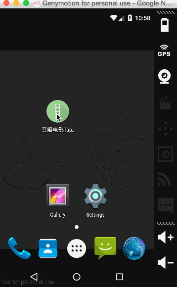

# Retrofit Demo

### 利用[Retrofit](http://square.github.io/retrofit/)获取豆瓣电影Top250信息

### 网上关于`Retrofit`的教程非常多，总结下来无非是要做三件事：
1. 构造Model(POJO)类. 直接通过`GsonFormatter`构造即可
2. 构造API接口. 为了避免阻塞UI Thread，建议使用回调方法，而非直接返回结果
3. 使用`RestAadpter`构造请求，获取回调结果

我对Retrofit的理解还非常浅薄，建议看看其他大牛写的博客，这篇[Retrofit Android Tutorial](http://themakeinfo.com/2015/04/retrofit-android-tutorial/)可以参看参考